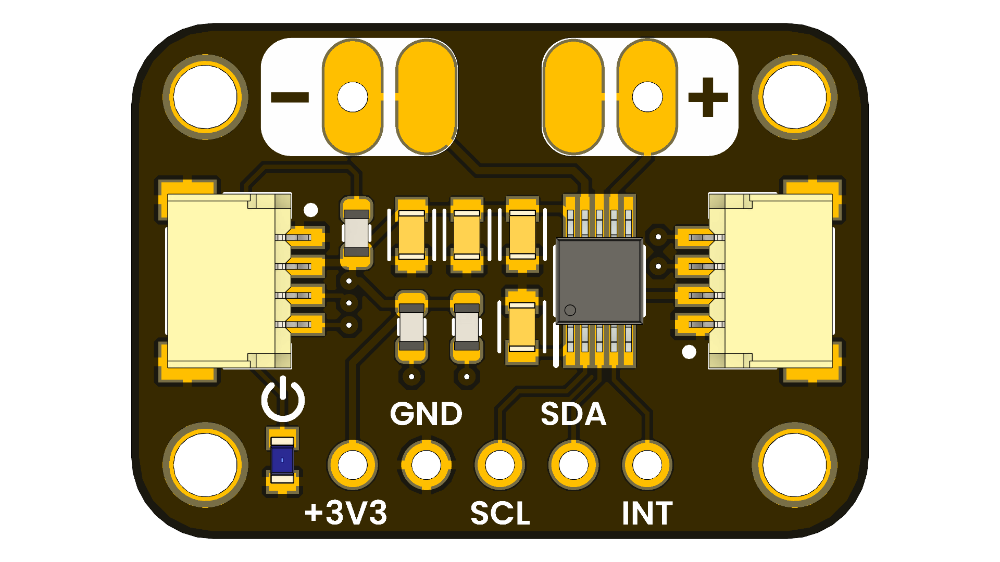

# Module DRV2605L Haptic Motor Driver

## Introduction

Unit Electronics developed a Haptic Motor Driver module for the DRV2605L IC from Texas Instruments. The DRV2605L is a versatile Haptic Driver for LRA and ERM motors, offering advanced features for haptic feedback applications. The module is available on the [Unit Electronics GitHub repository](https://github.com/UNIT-Electronics).

  

### Quick Setup

## 📦 Overview

| Feature                      | Description                        |
|------------------------------|------------------------------------|
| Compatibility                | Works seamlessly with Cocket Nova (SDCC Compiler), RP2040 and ESP32 (MicroPython) |
| Integrated Development Environments | Thonny IDE for MicroPython (ESP32 & RP2040), Visual Studio Code for Cocket Nova (SDCC) |
| Open Source                  | Hardware and software licensed under MIT |

## Licensing

This project is licensed under the **GNU General Public License v3.0 (GPL-3.0)** for all original work and modifications for Cocket NOVA.
However, portions of the code are based on [MCU Templates](https://github.com/wagiminator/MCU-Templates) by wagiminator, which are licensed under the **Creative Commons Attribution-ShareAlike 3.0 Unported License (CC BY-SA 3.0)**.

For more details, see:
- [CC BY-SA 3.0 License](http://creativecommons.org/licenses/by-sa/3.0/)
- [GPL-3.0 License](https://www.gnu.org/licenses/gpl-3.0.en.html)

This project is open source! Both the hardware and software are licensed under the MIT License for MicroPython:
- **Software:** [MIT License](https://opensource.org/licenses/MIT)

## Credits and References

- **Datasheet:** [DRV2605L Datasheet](https://www.ti.com/lit/ds/symlink/drv2605l.pdf)
- **Product Page:** [DRV2605L Product Page](https://www.ti.com/product/DRV2605L)
- **GitHub Repository:** [DRV2605L GitHub Repository](https://github.com/UNIT-Electronics/UNIT_DRV2605L_Haptic_Motor_Driver)

Special thanks to:
- [Stefan Wagner](https://github.com/wagiminator) for support with microcontroller CH552G and CH55x series.

## About Unit Electronics
The DRV2605L Haptic Motor Driver Module is developed and maintained by **Unit Electronics**, dedicated to creating open-source hardware and software solutions for embedded systems.

For questions, feedback, or contributions, feel free to reach out or submit issues through the [GitHub repository](https://github.com/UNIT-Electronics).
