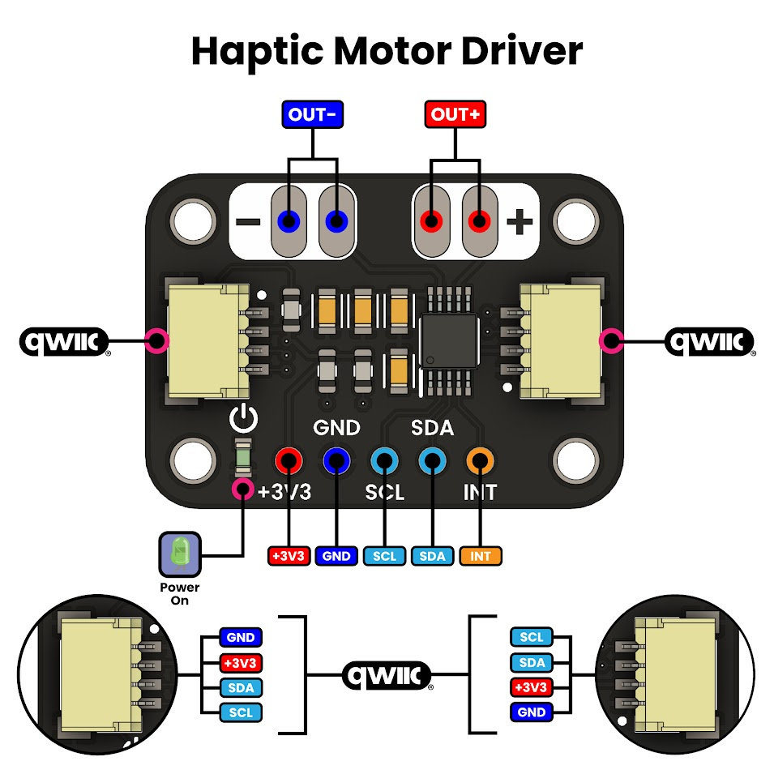
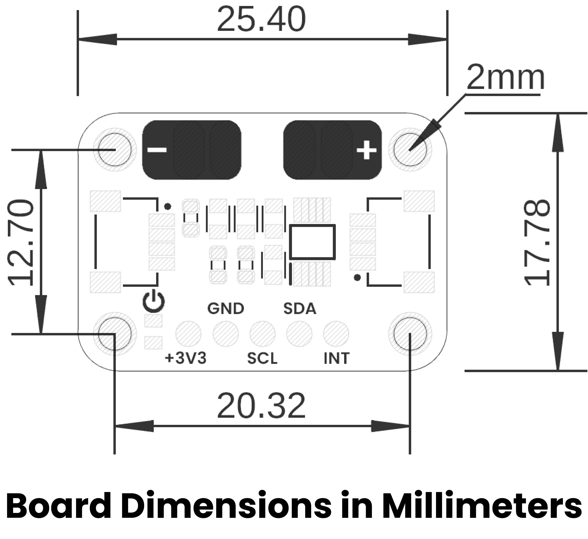

# Hardware

<a href="./unit_schematic_v_1_0_ue0065_DRV2605.pdf"></img src="./resources/Schematics_icon.jpg" width="500px">  Schematics</a>

---

## ⚙️ Technical Specifications

- **Interface:** I2C 
- **Input Voltage:** 3.3V-5V
- **Compatible With:** LRA (Linear Resonance Actuator) and ERM (Eccentric Rotating Mass) 

## 🔌 Pinout

<a href="./resources/unit_pinout_v_1_0_ue0065_DRV2605.jpg">  Pinout</a>

### **Pinout Details**

| Pin Label | Function         | Notes                             |
|-----------|------------------|-----------------------------------|
| +3V3      | Power Supply     | 3.3V Power Supply                 |
| GND       | Ground           | Common ground reference           |
| SCL       | I2C SCL          | Serial Clock Line                 |
| SDA       | I2C SDA          | Serial Data Line                  |
| INT       | Power Supply     | GPIO                              |
| OUT-      | Motor -          | Motor negative output             |
| OUT+      | Motor +          | Motor positive output             |

## 📏 Board Dimensions

<a href="./resources/unit_dimension_v_1_0_ue0065_DRV2605.png"> Dimensions</a>

## 📃 Board Topology

<a href="./resources/unit_topology_v_1_0_ue0065_DRV2605.png"> Topology</a>

| Ref.  | Description                                                                 |
|-------|-----------------------------------------------------------------------------|
| IC1   | DRV2605 Haptic Motor Driver                                                 |
| L1    | Power On LED                                                                |
| J1    | 1mm JST Connector compatible with QWIIC and STEMMA QT Connector             |
| J2    | 1mm JST Connector compatible with QWIIC and STEMMA QT Connector Jack        |
| J3    | Output for haptic motor                                                     |
| JP1   | Header for Input Signals                                                    |